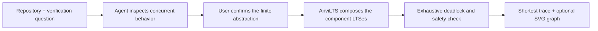

# AnviLTS

AnviLTS is a repository-aware formal-verification tool for concurrent systems. An AI coding agent inspects an implementation, works with the user to define a finite labelled transition system, and delegates the actual proof to a deterministic model-checking engine.

No FSP authoring, hosted backend, or API key is required. The bundled MCP server makes no network calls.



## Portable MCP server

The verification server is not tied to Codex. It is a standard local MCP server using the `stdio` transport, so any MCP client that can launch a Node.js subprocess can use its four tools:

- `validate_model`: validate component LTS definitions and optional safety monitors.
- `compose_lts`: construct the reachable parallel composition.
- `verify_lts`: detect deadlocks, reserved ERROR states, and safety-property violations.
- `render_lts`: render a dark SVG state graph with an optional highlighted trace.

The Codex plugin adds the repository-inspection and human-approval workflow. Other clients still receive the deterministic tools, but their agent needs equivalent modeling instructions. SVG presentation also depends on how that client displays MCP resources.

After cloning or building the repository, the portable server entry point is:

```text
plugins/anvilts/mcp/server.mjs
```

For example, a VS Code workspace can add `.vscode/mcp.json`:

```json
{
  "servers": {
    "anvilts": {
      "type": "stdio",
      "command": "node",
      "args": ["${workspaceFolder}/plugins/anvilts/mcp/server.mjs"],
      "cwd": "${workspaceFolder}/plugins/anvilts"
    }
  }
}
```

Use the same command and absolute bundle path in another MCP client according to that client's configuration format. Node.js 22.18 or newer is required.

## Install the Codex plugin

The repository includes a local plugin marketplace at `.agents/plugins/marketplace.json`. In the ChatGPT desktop app, restart after cloning, open **Plugins**, choose **AnviLTS Development**, install **AnviLTS**, and start a new task.

Codex CLI users can instead run:

```sh
codex plugin marketplace add .
codex plugin add anvilts@anvilts-local
```

## Judge demos

The examples are intentionally ordinary service code. Their names and comments do not disclose the concurrency defect.

### Document service

> Use $verify-concurrent-system to inspect `examples/document-service`. Document deletion occasionally stops responding while the audit uploader is active. Determine whether concurrency could explain it.

This exercises coordination between a document store and a buffered audit subsystem.

### Report service

> Use $verify-concurrent-system to inspect `examples/report-service`. Month-end batches reliably stop making progress when several accounts are processed together. Find the concurrency failure and verify your explanation.

This exercises a bounded executor and nested background work rather than explicit lock ordering.

### Session service

> Use $verify-concurrent-system to inspect `examples/session-service`. We see rare authentication stalls when key rotation overlaps heavy session refresh traffic. Determine whether the implementation permits a permanent wait.

This exercises asynchronous coordination across the session registry and key manager.

For each demo, Codex should inspect the code, propose a finite abstraction, and ask for confirmation. Once approved, AnviLTS validates the model and returns a shortest counterexample if the failure is reachable. The user can then ask Codex to fix the implementation and verify the revised model.

AnviLTS proves the approved model under its stated assumptions. It does not claim that model extraction establishes source-code equivalence.

## Development

```sh
npm install
npm run typecheck
npm run test:mcp
npm run build
npm run test:plugin
npm run parity
```

`npm run parity` compares the engine against 52 LTSA textbook-derived fixtures. The current suite has full verdict and graph parity: 52/52, with zero graph differences.

## Verification semantics

- Private actions interleave.
- Shared non-`tau` actions require every component whose alphabet contains the action to participate.
- `tau` is always private and never synchronizes.
- Reachable non-END states with no eligible transition are deadlocks.
- Safety properties are passive deterministic monitors; disallowed relevant actions enter ERROR.
- Breadth-first parent links produce a shortest counterexample trace.
- MCP calls default to a 100,000 reachable-state limit to prevent accidental state explosion.

See [IDEA.md](IDEA.md) for the product rationale and [the model reference](plugins/anvilts/skills/verify-concurrent-system/references/lts-model.md) for the JSON contract.
