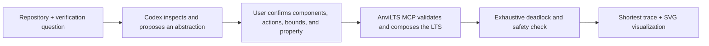

# AnviLTS

AnviLTS turns Codex into a repository-aware formal-verification partner for concurrent systems. Codex inspects the implementation, works with the user to produce an approved finite abstraction, and delegates the proof to a deterministic labelled-transition-system engine.

No FSP authoring, hosted backend, or user-supplied API key is required. The bundled MCP server makes no network calls.



## What the plugin contains

- `verify-concurrent-system`: a Codex skill for repository inspection, suitability triage, ambiguity resolution, human model approval, and precise result language.
- `validate_model`: validates component LTS definitions and optional safety monitors.
- `compose_lts`: constructs the reachable parallel composition with LTSA-compatible synchronization.
- `verify_lts`: detects deadlocks, reserved ERROR states, and safety-property violations, returning a shortest counterexample.
- `render_lts`: returns a dark SVG state graph and can highlight the counterexample trace.

The MCP server is bundled at `plugins/anvilts/mcp/server.mjs`, so plugin users need Node.js but do not need to install this repository's npm dependencies.

## Install in Codex

From the repository root:

```sh
codex plugin marketplace add .
codex plugin add anvilts@anvilts-local
```

Start a new Codex task after installation so the skill and MCP tools are loaded.

## Two-minute judge demo

Open this repository in Codex and ask:

> Use $verify-concurrent-system to inspect `examples/warehouse-deadlock/warehouse.py`. Can `process_order` and `issue_refund` deadlock when they run concurrently?

Codex should inspect the lock ordering, propose a finite model and ask for confirmation. After approval, it validates and verifies the model, returns the shortest circular-wait trace, and renders that trace as an SVG. Repeat against `warehouse_fixed.py` to show how a consistent acquisition order removes the deadlock from the model.

The important boundary is explicit: AnviLTS proves the approved model under its stated assumptions. It does not claim that model extraction establishes source-code equivalence.

## Development

Requires Node.js 22.18 or newer.

```sh
npm install
npm run typecheck:mcp
npm run test:mcp
npm run build:mcp
npm run test:plugin
npm run parity
```

`npm run parity` compares the engine against 52 LTSA textbook-derived fixtures. The current suite has full verdict and graph parity: 52/52, with zero graph differences.

The existing web prototype remains available with `npm run dev`; its examples and graph playground exercise the same core TypeScript engine.

## Verification semantics

- Private actions interleave.
- Shared non-`tau` actions require every component whose alphabet contains the action to participate.
- `tau` is always private and never synchronizes.
- Reachable non-END states with no eligible transition are deadlocks.
- Safety properties are passive deterministic monitors; disallowed relevant actions enter ERROR.
- Breadth-first parent links produce a shortest counterexample trace.
- MCP calls default to a 100,000 reachable-state limit to prevent accidental state explosion.

See [IDEA.md](IDEA.md) for the product rationale and [the model reference](plugins/anvilts/skills/verify-concurrent-system/references/lts-model.md) for the JSON contract.
